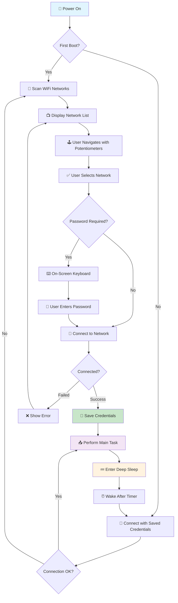
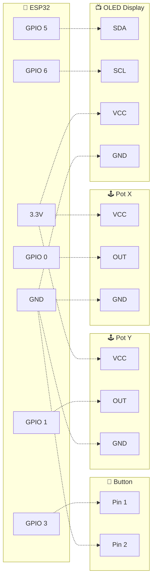

# 📟 WiFi Display Module

<div align="center">


*An interactive ESP32-powered WiFi configuration module with OLED display and analog controls*

🎯 **Easy WiFi Setup** • 🔋 **Ultra Low Power** • ⚙️ **Configurable Pins** • 📺 **OLED Display**

</div>

---

## 🚀 **Overview**

The WiFi Display Module is an ESP32-based IoT device that provides an intuitive interface for WiFi configuration using an OLED display and analog controls. Perfect for projects that need wireless connectivity with user-friendly setup.

### ✨ **Key Features**

- 🔌 **Interactive WiFi Selection** - Navigate networks with analog joystick/potentiometers
- 📱 **On-Screen Keyboard** - Enter WiFi passwords using display interface  
- 🔋 **Ultra Low Power** - Deep sleep mode for weeks/months of battery life
- ⚙️ **Pin Configuration** - Easy pin customization via `.env` files
- 📊 **Multiple ESP32 Support** - Works with ESP32, ESP32-C3, ESP32-S3
- 💾 **Credential Storage** - Automatic WiFi credential saving and recall
- 🔄 **Auto-Reconnect** - Seamless reconnection on subsequent boots

---

## 🛠️ **How It Works**



---

## 🧩 **Components Required**

### 📱 **Core Components**
| Component | Description | Qty | Notes |
|-----------|-------------|-----|-------|
| 🔷 **ESP32 Module** | ESP32/ESP32-C3/ESP32-S3 | 1 | Main microcontroller |
| 📺 **OLED Display** | SSD1306 128x64 I2C | 1 | 0.96" recommended |
| 🕹️ **Potentiometer X** | 10kΩ Linear | 1 | Horizontal navigation |
| 🕹️ **Potentiometer Y** | 10kΩ Linear | 1 | Vertical navigation |
| 🔘 **Push Button** | Momentary Switch | 1 | Selection/confirm |

### 🔧 **Optional Components**
| Component | Description | Purpose |
|-----------|-------------|---------|
| 🔋 **Battery** | 3.7V LiPo (3000mAh+) | Portable power |
| 📦 **Enclosure** | Custom 3D printed case | Protection |
| 🔌 **JST Connector** | Battery connection | Easy disconnection |

### 📏 **Wiring Connections**



---

## 📚 **Dependencies & Libraries**

### 🔗 **Arduino Libraries**
```ini
adafruit/Adafruit GFX Library@^1.12.0      # Graphics primitives
adafruit/Adafruit SSD1306@^2.5.13          # OLED display driver
adafruit/RTClib@^2.1.4                     # Real-time clock functionality
```

### 🛠️ **Development Tools**
-  **PlatformIO** - Build system and IDE
-  **Python 3.6+** - Configuration generator script

---

## ⚙️ **Pin Configuration**

This project uses a flexible pin configuration system that supports multiple ESP32 variants:

### 🔧 **Quick Setup**

1. **Copy configuration template:**
   ```bash
   cp .env.example .env.local
   ```

2. **Edit pins for your board:**
   ```bash
   # ESP32-C3 Super Mini example
   OLED_SDA_PIN=5
   OLED_SCL_PIN=6
   POT_X_PIN=0
   POT_Y_PIN=1
   BTN_SELECT=3
   ```

3. **Build project:**
   ```bash
   pio run -e esp32-c3
   ```

### 📋 **Supported Boards**

| Board | SDA | SCL | ADC Pins | Digital Pins |
|-------|-----|-----|----------|--------------|
| 🔷 **ESP32 DevKit** | 21 | 22 | 32-39 | 0,2,4,5,12-19,23,25-27 |
| 🔷 **ESP32-C3 Mini** | 5 | 6 | 0-4 | 0-10,18-21 |
| 🔷 **ESP32-S3** | 8 | 9 | 1-20 | Various |

> 📖 **Full configuration guide:** [PIN_CONFIG.md](PIN_CONFIG.md)

---

## 🔋 **Power Management**

### ⚡ **Power Consumption**

| Mode | Current Draw | Duration |
|------|--------------|----------|
| 🔍 **WiFi Scanning** | ~140 mA | ~21 hours |
| 📡 **Data Transmission** | ~190 mA | ~15.5 hours |
| 😴 **Deep Sleep** | ~5 μA | **Months** |
| 🔗 **Connected Idle** | ~40 mA | ~75 hours |

### 🔋 **Battery Life Calculator**

With a **3000mAh** battery:
- ⏰ **Always-on mode:** ~21 hours
- 💤 **Sleep cycle (5min intervals):** **Months**
- 🔄 **Smart wake (hourly):** **Weeks**

---

## 🚀 **Getting Started**

### 📦 **Installation**

1. **Clone the repository:**
   ```bash
   git clone https://github.com/123jason689/wifi-display-module.git
   cd wifi-display-module
   ```

2. **Install PlatformIO:**
   ```bash
   pip install platformio
   ```

3. **Configure pins:**
   ```bash
   cp .env.example .env.local
   # Edit .env.local with your pin assignments
   ```

4. **Build and upload:**
   ```bash
   pio run -e esp32-c3 --target upload
   ```

### 🎮 **Usage**

1. **🔌 Power on** - Device boots and scans for WiFi networks
2. **🕹️ Navigate** - Use potentiometers to select network
3. **✅ Select** - Press button to confirm selection
4. **⌨️ Enter password** - Use on-screen keyboard if required
5. **🔗 Connect** - Device connects and saves credentials
6. **💤 Sleep** - Enters deep sleep, wakes periodically

### 🔧 **Controls**

| Input | Action |
|-------|--------|
| 🕹️ **Potentiometer X** | Navigate left/right |
| 🕹️ **Potentiometer Y** | Navigate up/down |
| 🔘 **Button** | Select/Confirm |

---

## 🎯 **Use Cases**

- 🏠 **Smart Home Devices** - Easy WiFi setup for IoT sensors
- ⏰ **Digital Clocks** - Connected timepieces with WiFi sync
- 🌡️ **Weather Stations** - Remote monitoring with wireless connectivity
- 📊 **Data Loggers** - Wireless data transmission and storage
- 🔔 **Notification Displays** - Real-time alerts and messages

---

## 🛣️ **Roadmap**

- [ ] 📱 **Mobile App** - Smartphone configuration companion
- [ ] 🌐 **Web Interface** - Browser-based setup portal
- [ ] 📡 **LoRaWAN Support** - Long-range wireless communication
- [ ] 🔒 **WPA3 Security** - Enhanced security protocols
- [ ] 📈 **Data Analytics** - Usage statistics and monitoring
- [ ] 🎨 **Custom Themes** - Personalized display appearances

---

## 🤝 **Contributing**

Contributions are welcome! Please feel free to submit a Pull Request.

1. **Fork the project**
2. **Create your feature branch** (`git checkout -b feature/AmazingFeature`)
3. **Commit your changes** (`git commit -m 'Add some AmazingFeature'`)
4. **Push to the branch** (`git push origin feature/AmazingFeature`)
5. **Open a Pull Request**

---

## 📄 **License**

This project is licensed under the MIT License - see the [LICENSE](LICENSE) file for details.

---

## 🙏 **Acknowledgments**

- 🎨 **Adafruit** - Excellent display libraries
- 🔷 **Espressif** - ESP32 platform and documentation
- 🛠️ **PlatformIO** - Amazing development environment
- 🌐 **Arduino Community** - Inspiration and support

---

<div align="center">

**⭐ Star this project if you find it useful!**

Made with ❤️ by [123jason689](https://github.com/123jason689)


</div>